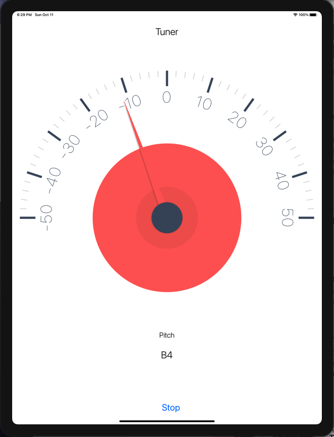

# SimpleTuner
Simple instrument tuner for iOS.

Clone the repository and then open the project file and build with XCode.

Based on [TuningFork](https://github.com/comyar/TuningFork) and [Partita](https://github.com/comyar/Partita), but adapted to work with [AudioKit 5.0](https://github.com/AudioKit/AudioKit).

